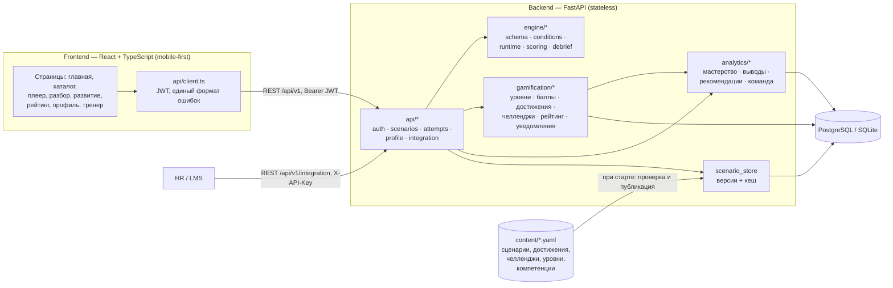
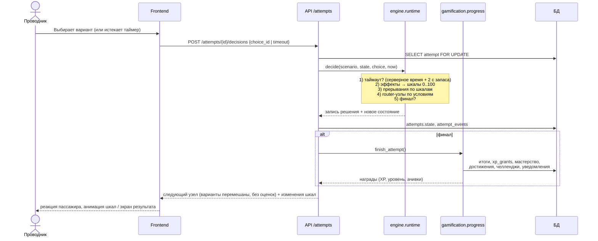
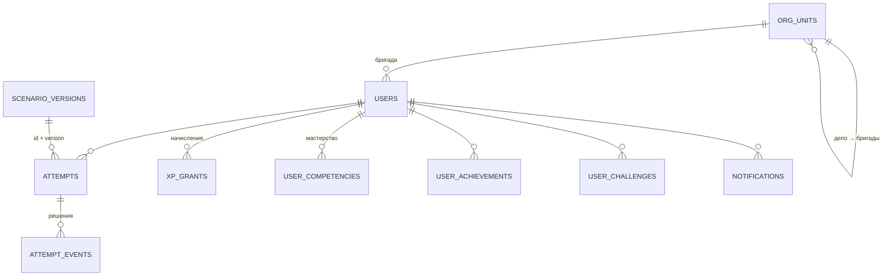

# Архитектура

## Компоненты

### Слои backend

| Слой | Ответственность | Зависит от |
|---|---|---|
| `engine` | Чистая логика сценария: формат, проверка графа, переходы, таймер, подсчёт, разбор. **Не знает о БД и HTTP**, тестируется изолированно | — |
| `gamification` | Замыкание цикла «очки → уровень → достижения → челленджи → рейтинг → уведомления» | engine, БД |
| `analytics` | Мастерство по компетенциям, выводы, рекомендации, командная сводка | БД |
| `api` | HTTP-контракт, права доступа, валидация запросов | все слои |
| `content` | Данные: всё, что меняет методист, а не программист | — |

**Правила игры — это данные.** Движок интерпретирует YAML, а достижения и челленджи описаны фильтрами
по завершённым попыткам. Новый сценарий, достижение или челлендж не требует изменения кода.

## Последовательность: решение игрока

## Ключевые решения

| Решение | Почему |
|---|---|
| Состояние попытки хранится в БД (JSON), а не в памяти | Backend не хранит состояние между запросами, поэтому можно запускать несколько экземпляров за балансировщиком |
| Таймер проверяется на сервере | Клиент не может «остановить время». Клиентский таймер нужен только для отображения и раннего сигнала |
| Варианты перемешиваются детерминированно (seed = попытка + узел) | Лучший ответ не угадать по позиции, при этом порядок не меняется при перезагрузке |
| Качество и обратная связь не отдаются во время игры | Нельзя подсмотреть правильный ответ в DevTools |
| Каждая версия сценария хранится отдельно | Незавершённые попытки и старые разборы работают на своей версии |
| Условия — строки из 3 токенов без `eval` | Безопасно и понятно методисту |
| Баллы рейтинга = начисления за 30 дней, XP уровня не сгорает | Уровень отражает накопленный опыт, рейтинг — текущую активность. Сгорание мотивирует тренироваться регулярно |
| Мастерство — экспоненциальное сглаживание (вес новой попытки 0.5) | Прогресс быстро отражается, одна неудача не обнуляет навык |
| Демо-история генерируется прогоном реального движка | Рейтинг, достижения и аналитика согласованы: цифры не нарисованы вручную |

## Модель данных

Отдельно хранится таблица `api_keys`: ключи внешних систем, только SHA-256 хэши.

## Масштабирование

- Backend stateless: состояние в БД, кеш разобранных сценариев неизменяем по ключу (id, версия). Экземпляры backend можно добавлять за балансировщиком.
- Двойную отправку ответа исключает блокировка строки попытки (`SELECT … FOR UPDATE` в PostgreSQL).
- Ограничения текущей версии: см. [roadmap.md](roadmap.md). Счётчик попыток входа хранится в памяти процесса, миграции делаются через `create_all`, уведомления приходят опросом.
