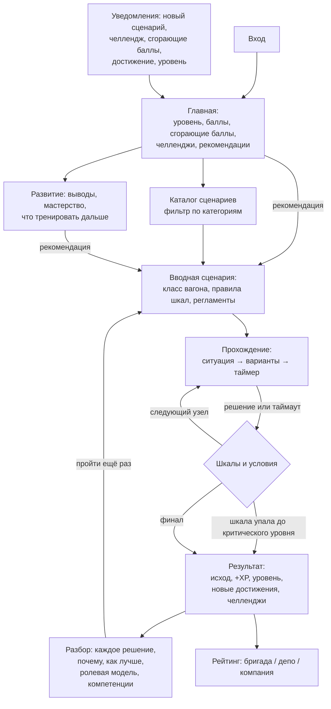
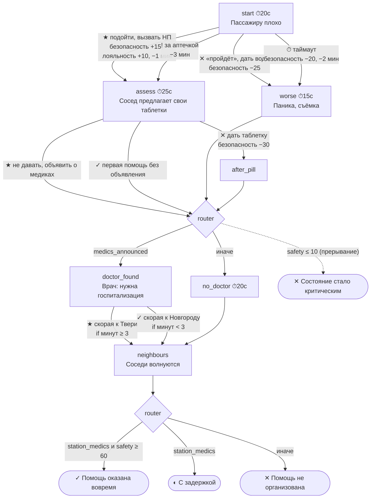

# Пользовательские сценарии (User Flow) и примеры игровых сценариев

## Проводник

Цикл мотивации: **действие → очки → достижения → рейтинг → уведомления → действие**.
Баллы рейтинга сгорают через 30 дней. За 5 дней до сгорания приходит уведомление, и возвращаться к тренировкам нужно регулярно.

## Тренер

1. **Команда → Бригады**: тепловая карта «бригада × компетенция» показывает, где проседает подразделение.
2. **Сотрудники**: таблица с уровнем, успешностью, баллами и самой слабой компетенцией; по клику открывается полная аналитика сотрудника.
3. **Сложные решения**: узлы сценариев с наибольшей долей ошибок и таймаутов, материал для планёрки.
4. **Сценарии**: выгрузить действующую версию, поправить, проверить и опубликовать. Сотрудники получат уведомление. Перезапуск не нужен.

## Внешние системы

- **HR** по расписанию вызывает `PUT /integration/employees/{external_id}` — заводит и обновляет сотрудников, бригады.
- **LMS** забирает `GET /integration/results?since=…` (итоги) и `GET /integration/events` (журнал решений, xAPI).

---

## Пример 1. «Пассажиру стало плохо» (медицина, комфорт-класс, сложность 3)

Механики: таймеры в критических узлах, переменная **«До Твери, мин»** (каждое действие отнимает время),
условные варианты (вызвать скорую к Твери можно, только если осталось ≥ 3 минут), прерывание при `safety <= 10`.

**Лучший путь** (проверяется автотестом `test_best_choices_lead_to_success`): подойти и вызвать НП → не давать
чужие лекарства, объявить о медиках → скорая к Твери → заверить соседей. Итог: безопасность 100, лояльность 90, успех.

**Типичная ошибка:** дать таблетку соседа. Безопасность падает на 30, затем узел «реакция на препарат». В разборе
объяснение со ссылкой на ситуацию №28 («не выдавать личные лекарства») и правильный вариант.

## Пример 2. «Пассажир с признаками опьянения» (конфликт, стандарт-класс)

Переменная **«Напряжение пассажира»** копит последствия провокаций, router выбирает ветку по ней.

| Узел | Решение | Лояльность | Безопасность | Напряжение | Куда ведёт |
|---|---|---|---|---|---|
| start | ★ Лично и негромко назвать правило (алкоголь только в бистро) | 0 | +10 | 0 | router → «нехотя подчинился» |
| start | ✕ Замечание на весь вагон | −10 | −10 | +2 | router → **агрессия** |
| partial_comply | ★ По рации: «вагон 8, место 23D, нужна помощь» | 0 | +15 | 0 | НП и ПТБ приходят |
| partial_comply | ✕ По рации: «в восьмом пьяный…» | 0 | −15 | +2 | **агрессия** (сит. №6: не говорить по рации, что пассажир пьян) |
| aggressive ⏱15с | ★ Держать дистанцию: «Готов помочь, но прошу общаться корректно», вызвать ПТБ | 0 | +20 | 0 | НП и ПТБ приходят |
| aggressive | ✕ Силой усадить пассажира | 0 | −30 | 0 | прерывание при `safety ≤ 15` → **драка** |

Одно и то же решение по-разному влияет на шкалы: например, «заверить соседей» поднимает только лояльность,
а «назвать правило» поднимает безопасность ценой лояльности.

## Остальные сценарии

| Сценарий | Ключевая развилка | Источник |
|---|---|---|
| Электронная сигарета в салоне | «Покурите в тамбуре» — ловушка; при отказе пассажира спор зацикливает узел, правильно пригласить НП | сит. №20 |
| Два пассажира на одно место | Не занимать сторону; сбой продаж → НП → повышение класса. В лучшем ответе все 4 шага ролевой модели | сит. №23, №33 |
| Бесхозная вещь | «Не трогать» (вскрыть сумку = прерывание), сообщить по поездной радиосвязи, без слова «бомба» | сит. №41, №45 |
| Потерялся ребёнок | Остаться с ребёнком; объявление без персональных данных (флаг `data_disclosed` не даёт успех) | сит. №30, №37 |
| Пассажир на кресле-коляске | Подъёмник, помощь с согласия, питание на место, подготовка высадки | СТО 03.014 |
